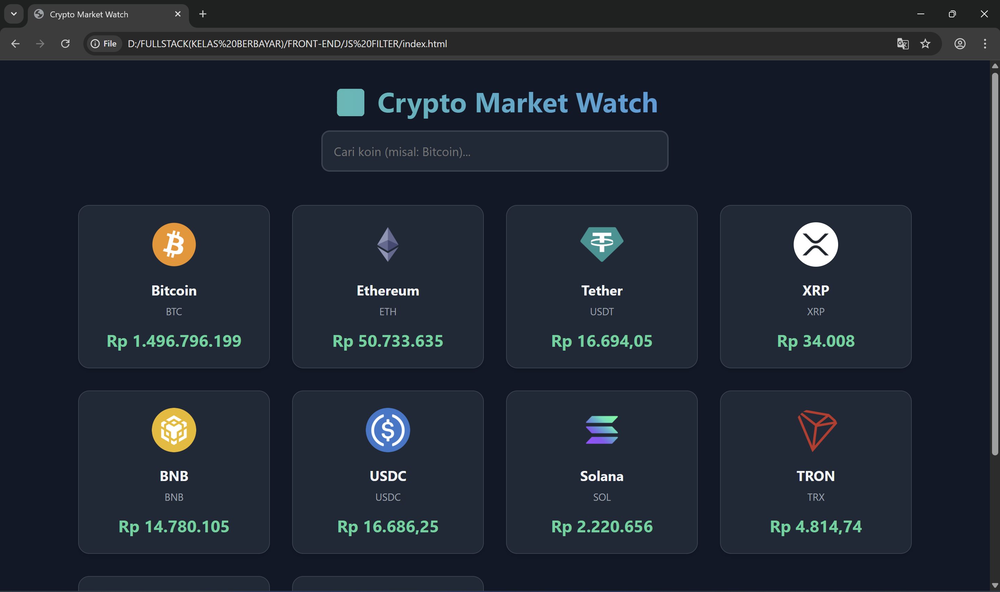

# 📈 Crypto Market Watch


*(Gambar di atas adalah screenshot tampilan aplikasi)*

**Crypto Market Watch** adalah dashboard pemantau harga aset kripto (Cryptocurrency) secara *real-time*. Aplikasi ini menampilkan data 10 koin teratas berdasarkan kapitalisasi pasar dan dilengkapi dengan fitur pencarian instan yang responsif. Project ini dibangun untuk mendemonstrasikan penguasaan manipulasi data array modern di JavaScript.

🔗 **Live Demo:** [Klik Disini untuk Mencoba Aplikasi](https://crypto-market-watch.vercel.app/)

---

## 🚀 Fitur Utama

- **⚡ Real-Time Market Data:** Mengambil data harga, simbol, dan gambar koin terbaru langsung dari [CoinGecko API](https://www.coingecko.com/en/api).
- **🔍 Instant Search (Filter):** Fitur pencarian cepat yang menyaring daftar koin secara *real-time* saat user mengetik, tanpa perlu reload halaman.
- **📱 Responsive Grid Layout:** Tampilan kartu yang otomatis menyesuaikan diri (Grid System) di berbagai ukuran layar, dari HP hingga Desktop.
- **🎨 Dynamic Rendering:** UI tidak ditulis manual (hardcode), melainkan di-generate secara otomatis dari data Array menggunakan `.map()`.
- **🛡️ Error Handling:** Menampilkan pesan user-friendly jika terjadi kesalahan jaringan atau API limit.

---

## 🛠️ Teknologi yang Digunakan

| Kategori | Teknologi | Penjelasan Penggunaan |
| :--- | :--- | :--- |
| **Frontend** | HTML5 | Struktur semantik aplikasi. |
| **Styling** | CSS3 | **CSS Grid** & Flexbox untuk layout responsif, Dark Mode theme. |
| **Logic** | JavaScript (ES6+) | `map`, `filter`, `async/await`, DOM Manipulation. |
| **Data** | CoinGecko API | Endpoint publik untuk data pasar kripto. |
| **Deployment** | Vercel | Hosting aplikasi. |

---

## 🧠 Konsep Coding yang Diterapkan

Project ini adalah latihan tingkat lanjut ("The Data Bender") untuk transisi menuju Framework React. Konsep kunci yang diterapkan meliputi:

1.  **Array Manipulation (Functional Programming):**
    * **`.map()`**: Digunakan untuk mengubah *Array of Objects* (Data API) menjadi elemen HTML visual. Ini menggantikan looping manual `for`.
    * **`.filter()`**: Digunakan pada fitur Search untuk menyaring array berdasarkan input keyword user secara dinamis.

2.  **Asynchronous Data Flow:**
    * Menggunakan pola `Async/Await` untuk mengambil data JSON dari server eksternal.
    * Manajemen *State* sederhana menggunakan variabel global untuk menyimpan data mentah agar tidak perlu *refetch* saat melakukan filtering.

3.  **Modern Syntax (ES6):**
    * Penggunaan `Template Literals` (Backticks) untuk menyusun HTML string dengan variabel.
    * Penggunaan `const` dan `let` untuk manajemen variabel yang aman.

---

## 💻 Cara Menjalankan di Local

1.  **Clone Repository**
    ```bash
    git clone [https://github.com/NzxCode/crypto-market-watch.git](https://github.com/NzxCode/crypto-market-watch.git)
    ```

2.  **Buka Folder**
    ```bash
    cd crypto-market-watch
    ```

3.  **Jalankan**
    * Buka file `index.html` di browser favorit Anda.
    * (Opsional) Gunakan **Live Server** di VS Code untuk performa terbaik.

---

Made with ❤️ by **Nicolas** *Information Systems Student @ UNTAR | Inspiring Full Stack Web Dev*
